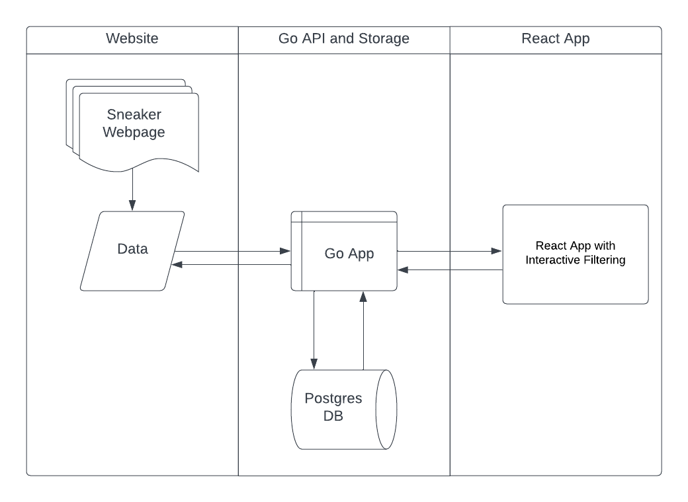

# Sneaker Collector App

The Sneaker Collector App is a Go application that scrapes sneaker information from various websites and stores the data in a PostgreSQL database. It also provides a simple API to retrieve the collected data and log entries and uses a React app to view the sneakers on the browser. The brands included are:

- Nike
- Adidas
- New Balance

Data collected currently includes:

- Name
- Price
- Link
- Brand

## Table of Contents

- [Design](#design)
- [Requirements](#requirements)
- [Getting Started](#gettingstarted)
- [Customization](#customization)
- [License](#license)

## Design



To build this I build a Go app with an API that pulls data from sneakers websites and stores then in a Postgres DB. There are 2 ways I pulled data:

- The [Nike](scrapper/nike.go) website is doing requests directly from the API so I simple made the request to get the JSON.
- For [Adidas and New Balance](scrapper/html_scrapper.go) I scrapped direcyl from the HTML. Since the format for both is similar I iterated through a map for both so it'd be simpler.

Once the data is pulled it stores the data directly to the database. This operation is automated by a cron job which you can select the frequency [here](scheduler/scheduler.go).

The React app interacts with the data through the API so it pull the data and displays it via an interactive table. To access it you simply start the rect app using **npm start** and it'll prompt you a login page where you introduce you database host and credentials.

## Requirements

- Docker and Docker Compose
- Go 1.20+
- Postgres and PgAdmin
- React

## Getting Started

1. Clone this repository to your local machine:

   ```sh
   git clone https://github.com/yourusername/sneaker-collector.git
   cd sneaker-collector
   ```

Create a content.json file at the root of the project directory containing your initial sneaker data (only applicable for Nike API).

2. Open the [docker-compose](docker-compose.yml) file and update the environment variables for the sneaker-db service to match your desired PostgreSQL settings.

3. Build and start the containers using Docker Compose:

   ```sh
   docker-compose up --build
   ```

This will start the PostgreSQL database, pgAdmin for managing the database.

4. Build the sneaker app:

   ```sh
   go build
   ```

This will build you Sneaker app then you open it.

5. The app will propmpt you to input the user, password and host.You have 2 tries before the app exits.

6. Access the Sneaker Collector App API by opening a web browser or using a tool like curl:

To get Shoes for a selected brand:

    http://localhost:port/protected?action=latest_shoes&brand=selected_brand

To get sneaker data:

    http://localhost:port/protected?action=sneaker_db_data

To trigger data refresh:

    http://localhost:port/protected?action=refresh_data

Access the pgAdmin web interface by navigating to http://localhost:8080 in your browser. Log in using the credentials defined in the [docker-compose](docker-compose.yml) file.

## Customization

To modify the scraping logic and data sources, update the appropriate functions in the scrapper package.

To customize the API behavior, update the handlers in the [main](main.go) Go file.

To change the database schema, update the SQL statements in the database module.

## License

This project is licensed under the [MIT License](LICENSE).
